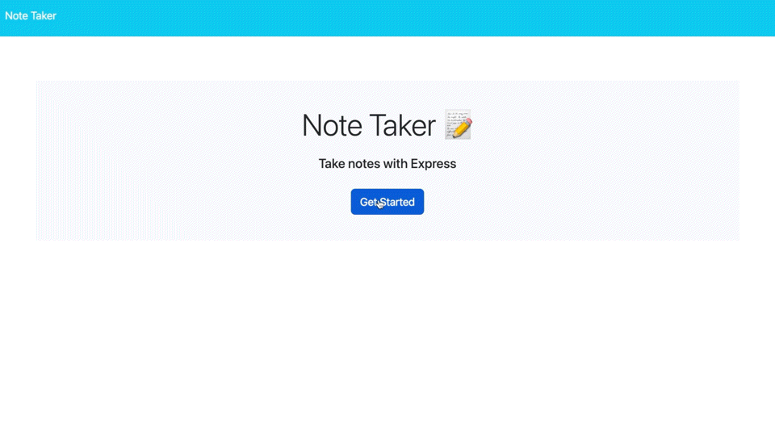

# 11-note-taker

## Description

Note Taker is a an application you can use to write, save, and delete notes so that your thoughts and tasks will be organized.

<h3 align="center">
    <a href="">
    Deployed Application
    </a>
</h3>

## Table of Contents

- [Visual](#visual)
- [Usage](#usage)
- [Contributing](#contributing)
- [License](#license)
- [Questions](#questions)

## Visual

## Usage

When you first open the site, you are taken to the homepage. After clicking the Get Started button, you are taken to the notes page. Within the notes page, you can view your notes, create new ones, and delete any that have been completed. Use the right hand side of the page to create new notes. Once you have entered a title and added some content to your note, a save button will appear next to the plus in the top right corner of the page so that you can save your note. After it is saved, you will see your note appear in the left hand column. If you would like to view the full note, you can click on the note in the left hand column and it will apear in full on the right. If you would like to delete your note after you have completed it, you can click the garbage can icon on the note in the left hand column. If you would like to have a clean slate to create a new note on the right hand side, you can click on the plus button in the top right corner. 

## Contributing

If you would like to contribute to this project, you can create a fork of this repository.

## License

    
## Questions

[My GitHub](https://github.com/lnsvn)

If you have further questions about this application, I can be reached by [e-mail](lsullivan301@yahoo.com)
